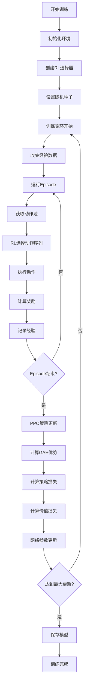

# v4.1强化学习系统现状流程文档

## 1. 系统概述

v4.1强化学习系统是基于城市模拟的强化学习训练框架，支持PPO/MAPPO算法，实现了多智能体协同决策的城市建设模拟。

### 1.1 核心特性
- **多智能体系统**：支持IND（工业）、EDU（教育）、Council（政府）三种智能体
- **强化学习算法**：基于PPO/MAPPO的深度强化学习训练
- **城市模拟环境**：基于地价驱动的城市发展模拟
- **动作序列决策**：支持多步动作序列的智能决策
- **预算约束系统**：支持智能体预算管理和约束

## 2. 系统架构

### 2.1 整体架构图

```
┌─────────────────────────────────────────────────────────────┐
│                    v4.1强化学习系统架构                      │
├─────────────────────────────────────────────────────────────┤
│  主控制器 (enhanced_city_simulation_v4_1.py)                │
│  ├─ 参数化模式 (ParamSelector)                              │
│  └─ RL模式 (RLPolicySelector + PPOTrainer)                │
├─────────────────────────────────────────────────────────────┤
│  环境层 (envs/v4_1/city_env.py)                            │
│  ├─ 城市环境包装器 (CityEnvironment)                       │
│  ├─ 地价系统 (GaussianLandPriceSystem)                     │
│  └─ 状态管理 (State Management)                            │
├─────────────────────────────────────────────────────────────┤
│  求解器层 (solvers/v4_1/)                                  │
│  ├─ RL选择器 (rl_selector.py)                              │
│  ├─ 参数选择器 (param_selector.py)                         │
│  └─ 策略网络 (Actor/Critic)                               │
├─────────────────────────────────────────────────────────────┤
│  训练器层 (trainers/v4_1/)                                  │
│  ├─ PPO训练器 (ppo_trainer.py)                             │
│  ├─ MAPPO训练器 (mappo_trainer.py)                         │
│  └─ 训练记录器 (enhanced_training_logger.py)               │
├─────────────────────────────────────────────────────────────┤
│  逻辑层 (logic/)                                            │
│  ├─ 动作枚举器 (v4_enumeration.py)                          │
│  ├─ 智能体系统 (enhanced_agents.py)                        │
│  └─ 地价系统 (enhanced_sdf_system.py)                      │
└─────────────────────────────────────────────────────────────┘
```

### 2.2 核心组件

#### 2.2.1 主控制器
- **文件**: `enhanced_city_simulation_v4_1.py`
- **功能**: 系统入口，支持参数化和RL两种模式
- **关键方法**:
  - `run_param_mode()`: 运行参数化模式
  - `run_rl_mode()`: 运行RL模式
  - `evaluate_rl_model()`: 评估RL模型
  - `train_rl_model()`: 训练RL模型

#### 2.2.2 环境层
- **文件**: `envs/v4_1/city_env.py`
- **功能**: 城市环境包装器，提供RL训练接口
- **关键组件**:
  - `CityEnvironment`: 环境主类
  - 状态空间：地价场、建筑状态、预算信息
  - 动作空间：建筑放置动作序列
  - 奖励函数：基于收益、成本、声望的综合奖励

#### 2.2.3 求解器层
- **RL选择器** (`solvers/v4_1/rl_selector.py`):
  - `RLPolicySelector`: RL策略选择器
  - `Actor`: 策略网络（动作选择）
  - `Critic`: 价值网络（状态价值估计）
- **参数选择器** (`solvers/v4_1/param_selector.py`):
  - `ParamSelector`: 参数化策略选择器

#### 2.2.4 训练器层
- **PPO训练器** (`trainers/v4_1/ppo_trainer.py`):
  - `PPOTrainer`: PPO算法实现
  - 支持MAPPO多智能体训练
  - 自适应KL调整机制
- **训练记录器** (`enhanced_training_logger.py`):
  - 详细的训练过程记录
  - 槽位选择历史追踪
  - 预算变化监控

## 3. 数据流程

### 3.1 训练流程



### 3.2 状态空间

#### 3.2.1 环境状态
- **地价场**: 高斯地价系统生成的地价分布
- **建筑状态**: 已建建筑的位置、类型、规模
- **预算信息**: 各智能体的预算余额
- **时间信息**: 当前月份、智能体轮次

#### 3.2.2 观察空间
- **状态编码**: 512维状态向量
- **动作特征**: 动作池的特征表示
- **掩码信息**: 非法动作的掩码

### 3.3 动作空间

#### 3.3.1 动作类型
- **IND智能体**: S/M/L三种规模的工业建筑
- **EDU智能体**: S/M/L三种规模的教育建筑  
- **Council智能体**: A/B/C三种规模的政府建筑

#### 3.3.2 动作序列
- **序列长度**: 最多5步动作序列
- **约束条件**: 动作间不能冲突
- **选择策略**: 基于PPO策略网络的动作选择

## 4. 智能体交互

### 4.1 智能体类型

#### 4.1.1 IND智能体（工业）
- **决策目标**: 最大化工业收益
- **建筑类型**: 工业建筑（S/M/L）
- **约束条件**: 预算限制、地价约束
- **奖励函数**: 基于收益、成本、声望的综合评分

#### 4.1.2 EDU智能体（教育）
- **决策目标**: 最大化教育收益
- **建筑类型**: 教育建筑（S/M/L）
- **特殊机制**: 与Council共享预算
- **奖励函数**: 教育收益、社会效益

#### 4.1.3 Council智能体（政府）
- **决策目标**: 最大化政府收益
- **建筑类型**: 政府建筑（A/B/C）
- **特殊机制**: 对岸建设奖励
- **奖励函数**: 政府收益、区域发展

### 4.2 智能体交互模式

#### 4.2.1 轮次制交互
- **IND单月执行**: 奇数月执行
- **EDU+Council双月执行**: 偶数月同时执行
- **交替模式**: 同一月内EDU和Council交替执行

#### 4.2.2 预算共享机制
- **EDU-Council预算共享**: Council使用EDU预算
- **预算约束**: 防止超预算建设
- **破产机制**: 预算不足时的惩罚

## 5. 奖励系统

### 5.1 奖励组成

#### 5.1.1 基础奖励
- **收益奖励**: 基于建筑收益的月度收入
- **成本惩罚**: 建设成本和运营成本
- **声望奖励**: 基于建筑规模的声望值

#### 5.1.2 特殊奖励
- **对岸奖励**: Council在对岸建设的额外奖励
- **邻近奖励**: 建筑邻近的奖励加成
- **多样性奖励**: 建筑类型多样性的奖励

### 5.2 奖励计算

```python
# 基础奖励计算
reward = revenue - cost + prestige

# 特殊奖励
if agent == 'Council' and other_side:
    reward += other_side_bonus

# 邻近奖励
if adjacency_bonus:
    reward += adjacency_bonus
```

## 6. 训练配置

### 6.1 超参数配置

#### 6.1.1 PPO参数
- **clip_eps**: 0.15 (PPO裁剪率)
- **gamma**: 0.99 (折扣因子)
- **gae_lambda**: 0.8 (GAE参数)
- **entropy_coef**: 0.01 (熵系数)
- **value_loss_coef**: 0.1 (价值损失系数)

#### 6.1.2 训练参数
- **rollout_steps**: 20 (经验收集步数)
- **num_epochs**: 8 (更新轮数)
- **max_updates**: 10 (最大更新次数)
- **mini_batch_size**: 32 (小批量大小)

### 6.2 网络架构

#### 6.2.1 Actor网络
- **输入维度**: 512 (状态编码)
- **隐藏层**: 256 → 128
- **输出维度**: 50 (最大动作数)
- **激活函数**: ReLU

#### 6.2.2 Critic网络
- **输入维度**: 512 (状态编码)
- **隐藏层**: 256 → 128
- **输出维度**: 1 (状态价值)
- **激活函数**: ReLU

## 7. 训练监控

### 7.1 训练指标

#### 7.1.1 损失指标
- **策略损失**: PPO策略损失
- **价值损失**: 价值网络损失
- **熵损失**: 策略熵损失
- **总损失**: 综合损失

#### 7.1.2 性能指标
- **KL散度**: 策略更新幅度
- **裁剪比例**: PPO裁剪比例
- **优势函数**: GAE优势估计
- **奖励统计**: 平均奖励、奖励方差

### 7.2 记录系统

#### 7.2.1 训练记录
- **详细日志**: JSON格式的详细训练日志
- **CSV摘要**: 训练指标的CSV记录
- **模型版本**: 带版本控制的模型保存

#### 7.2.2 槽位选择历史
- **选择记录**: 每个Episode的槽位选择历史
- **统计信息**: 选择频率、得分分布
- **可视化数据**: 用于后续分析的数据

## 8. 评估系统

### 8.1 评估模式

#### 8.1.1 模型评估
- **多种子评估**: 使用不同随机种子的评估
- **性能指标**: 总奖励、各智能体奖励
- **稳定性**: 多次评估的方差分析

#### 8.1.2 对比评估
- **参数化vs RL**: 两种模式的性能对比
- **改进分析**: RL相对于参数化的改进程度
- **成本效益**: 训练成本与性能提升的权衡

### 8.2 评估指标

#### 8.2.1 奖励指标
- **总奖励**: 所有智能体的总奖励
- **智能体奖励**: 各智能体的独立奖励
- **奖励分布**: 奖励的统计分布

#### 8.2.2 选择指标
- **槽位选择**: 选择的槽位分布
- **动作多样性**: 动作类型的多样性
- **序列质量**: 动作序列的质量评分

## 9. 系统优化

### 9.1 训练优化

#### 9.1.1 自适应调整
- **KL自适应**: 基于KL散度的学习率调整
- **探索率调整**: 动态调整探索率
- **温度缩放**: 动作分布的温度控制

#### 9.1.2 网络优化
- **权重初始化**: 正交初始化提高训练稳定性
- **梯度裁剪**: 防止梯度爆炸
- **正则化**: L2正则化防止过拟合

### 9.2 环境优化

#### 9.2.1 状态编码
- **特征工程**: 状态特征的工程化处理
- **归一化**: 输入数据的归一化处理
- **掩码机制**: 非法动作的掩码处理

#### 9.2.2 动作空间
- **动作过滤**: 基于约束的动作过滤
- **序列生成**: 高效的动作序列生成
- **冲突检测**: 动作间冲突的检测和避免

## 10. 部署和使用

### 10.1 训练启动

#### 10.1.1 命令行参数
```bash
python enhanced_city_simulation_v4_1.py \
    --config configs/city_config_v4_1.json \
    --mode rl \
    --eval_only False
```

#### 10.1.2 配置文件
- **主配置**: `configs/city_config_v4_1.json`
- **RL参数**: 在配置文件的`solver.rl`部分
- **环境参数**: 在配置文件的`growth_v4_1`部分

### 10.2 模型管理

#### 10.2.1 模型保存
- **自动版本控制**: 基于时间戳和配置哈希的版本控制
- **定期保存**: 每N个更新保存一次模型
- **最终保存**: 训练完成后的最终模型

#### 10.2.2 模型加载
- **评估模式**: 加载预训练模型进行评估
- **继续训练**: 从检查点继续训练
- **模型对比**: 不同模型版本的性能对比

## 11. 技术特点

### 11.1 创新点

#### 11.1.1 多智能体协同
- **MAPPO实现**: 多智能体PPO算法
- **预算共享**: EDU和Council的预算共享机制
- **交替执行**: 智能体间的交替决策模式

#### 11.1.2 动作序列决策
- **序列优化**: 多步动作序列的优化选择
- **冲突避免**: 动作间冲突的智能避免
- **束搜索**: 高效的序列搜索算法

### 11.2 技术优势

#### 11.2.1 训练稳定性
- **自适应调整**: 基于训练状态的参数自适应
- **梯度控制**: 梯度裁剪和正则化
- **经验回放**: 高效的经验数据管理

#### 11.2.2 可扩展性
- **模块化设计**: 清晰的模块化架构
- **配置驱动**: 基于配置的参数管理
- **插件机制**: 易于扩展的插件机制

## 12. 总结

v4.1强化学习系统是一个完整的城市模拟强化学习框架，具有以下特点：

1. **完整的RL训练流程**: 从环境交互到策略更新的完整流程
2. **多智能体协同**: 支持多个智能体的协同决策
3. **丰富的奖励机制**: 基于收益、成本、声望的综合奖励
4. **高效的训练算法**: 基于PPO/MAPPO的高效训练
5. **完善的监控系统**: 详细的训练过程监控和记录
6. **灵活的配置管理**: 基于JSON的灵活配置系统

该系统为城市规划和智能决策提供了强大的技术支撑，能够通过强化学习自动优化城市建设策略，实现更高效、更智能的城市发展模拟。
