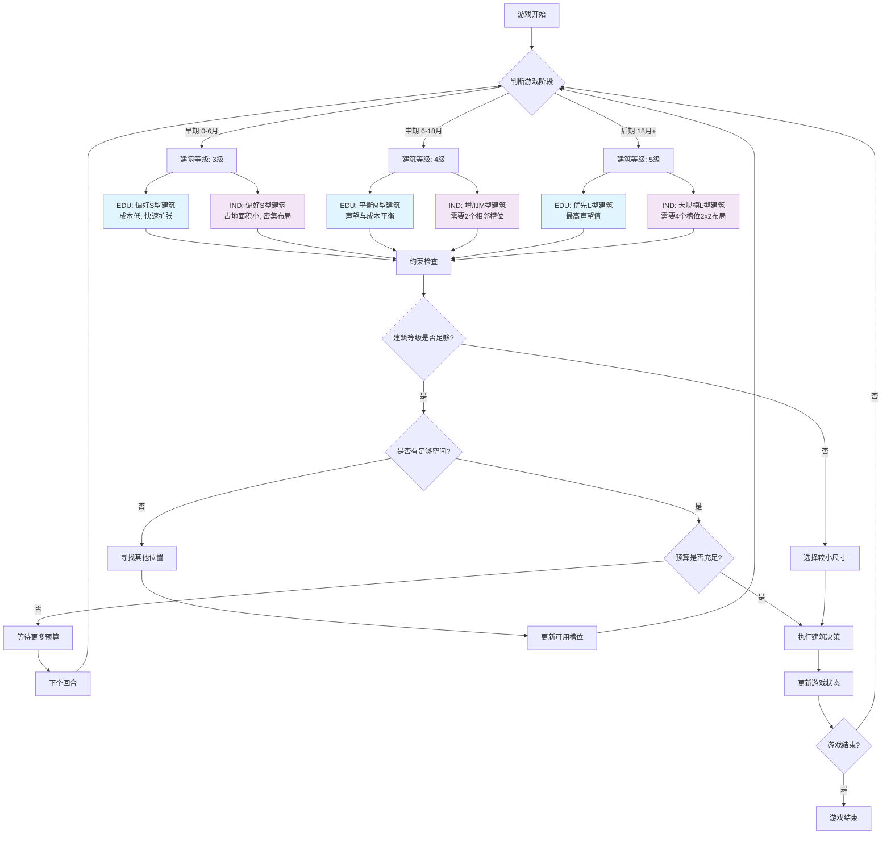
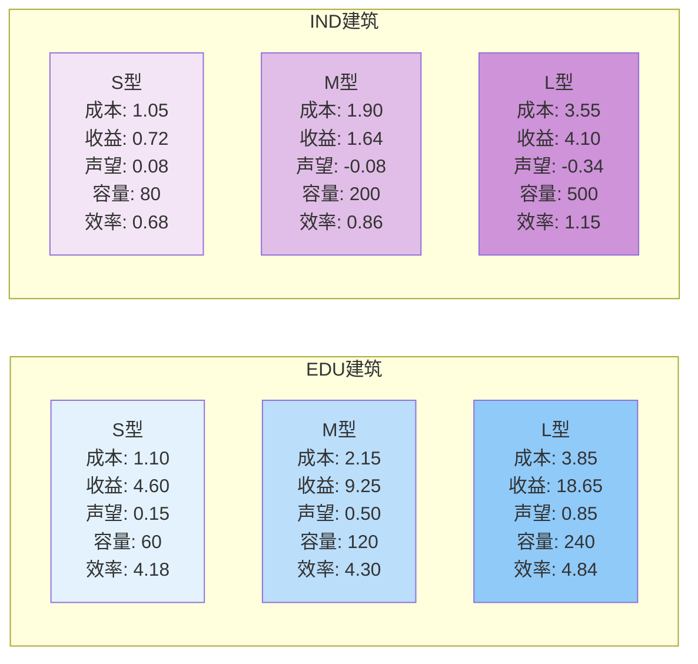
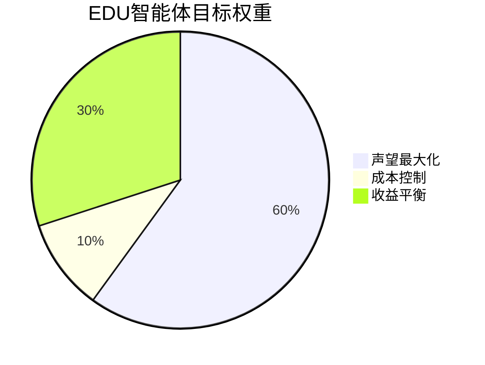
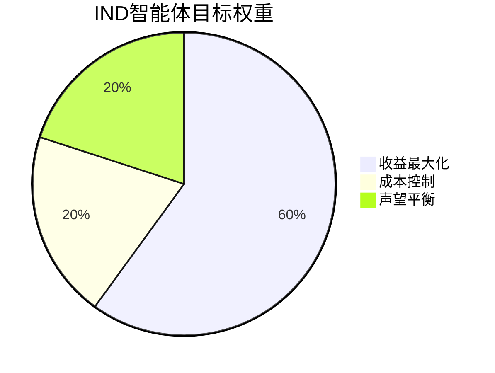
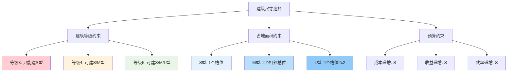

# RL模型建筑尺寸决策流程图

```mermaid
graph TD
    A[游戏开始] --> B{判断游戏阶段}
    
    B -->|早期 0-6月| C[建筑等级: 3级]
    B -->|中期 6-18月| D[建筑等级: 4级]
    B -->|后期 18月+| E[建筑等级: 5级]
    
    C --> F[EDU: 偏好S型建筑<br/>成本低, 快速扩张]
    C --> G[IND: 偏好S型建筑<br/>占地面积小, 密集布局]
    
    D --> H[EDU: 平衡M型建筑<br/>声望与成本平衡]
    D --> I[IND: 增加M型建筑<br/>需要2个相邻槽位]
    
    E --> J[EDU: 优先L型建筑<br/>最高声望值]
    E --> K[IND: 大规模L型建筑<br/>需要4个槽位2x2布局]
    
    F --> L[约束检查]
    G --> L
    H --> L
    I --> L
    J --> L
    K --> L
    
    L --> M{建筑等级是否足够?}
    M -->|否| N[选择较小尺寸]
    M -->|是| O{是否有足够空间?}
    
    O -->|否| P[寻找其他位置]
    O -->|是| Q{预算是否充足?}
    
    Q -->|否| R[等待更多预算]
    Q -->|是| S[执行建筑决策]
    
    N --> S
    P --> T[更新可用槽位]
    R --> U[下个回合]
    S --> V[更新游戏状态]
    
    T --> B
    U --> B
    V --> W{游戏结束?}
    
    W -->|否| B
    W -->|是| X[游戏结束]
    
    style F fill:#e1f5fe
    style G fill:#f3e5f5
    style H fill:#e1f5fe
    style I fill:#f3e5f5
    style J fill:#e1f5fe
    style K fill:#f3e5f5
```

## 建筑尺寸对比表

```mermaid
graph LR
    subgraph "EDU建筑"
        EDU_S[S型<br/>成本: 1.10<br/>收益: 4.60<br/>声望: 0.15<br/>容量: 60<br/>效率: 4.18]
        EDU_M[M型<br/>成本: 2.15<br/>收益: 9.25<br/>声望: 0.50<br/>容量: 120<br/>效率: 4.30]
        EDU_L[L型<br/>成本: 3.85<br/>收益: 18.65<br/>声望: 0.85<br/>容量: 240<br/>效率: 4.84]
    end
    
    subgraph "IND建筑"
        IND_S[S型<br/>成本: 1.05<br/>收益: 0.72<br/>声望: 0.08<br/>容量: 80<br/>效率: 0.68]
        IND_M[M型<br/>成本: 1.90<br/>收益: 1.64<br/>声望: -0.08<br/>容量: 200<br/>效率: 0.86]
        IND_L[L型<br/>成本: 3.55<br/>收益: 4.10<br/>声望: -0.34<br/>容量: 500<br/>效率: 1.15]
    end
    
    style EDU_S fill:#e3f2fd
    style EDU_M fill:#bbdefb
    style EDU_L fill:#90caf9
    style IND_S fill:#f3e5f5
    style IND_M fill:#e1bee7
    style IND_L fill:#ce93d8
```

## RL智能体决策权重

```mermaid
pie title EDU智能体目标权重
    "声望最大化" : 60
    "成本控制" : 10
    "收益平衡" : 30
```

```mermaid
pie title IND智能体目标权重
    "收益最大化" : 60
    "成本控制" : 20
    "声望平衡" : 20
```

## 约束条件影响

```mermaid
graph TD
    A[建筑尺寸选择] --> B[建筑等级约束]
    A --> C[占地面积约束]
    A --> D[预算约束]
    
    B --> B1[等级3: 只能建S型]
    B --> B2[等级4: 可建S/M型]
    B --> B3[等级5: 可建S/M/L型]
    
    C --> C1[S型: 1个槽位]
    C --> C2[M型: 2个相邻槽位]
    C --> C3[L型: 4个槽位2x2]
    
    D --> D1[成本递增: S<M<L]
    D --> D2[收益递增: S<M<L]
    D --> D3[效率递增: S<M<L]
    
    style B1 fill:#ffcdd2
    style B2 fill:#fff3e0
    style B3 fill:#e8f5e8
    style C1 fill:#e3f2fd
    style C2 fill:#bbdefb
    style C3 fill:#90caf9
```

